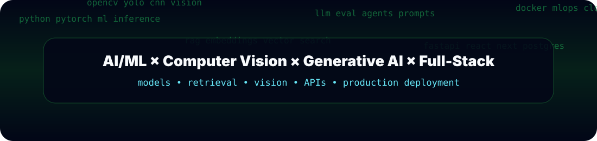
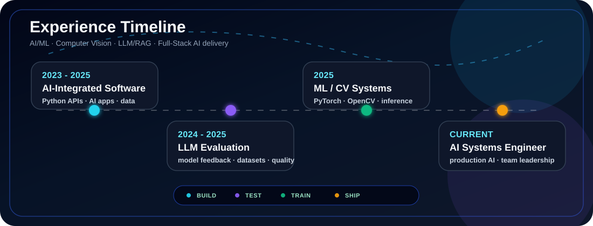
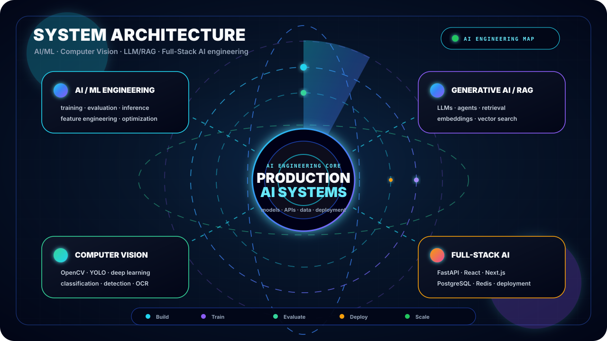
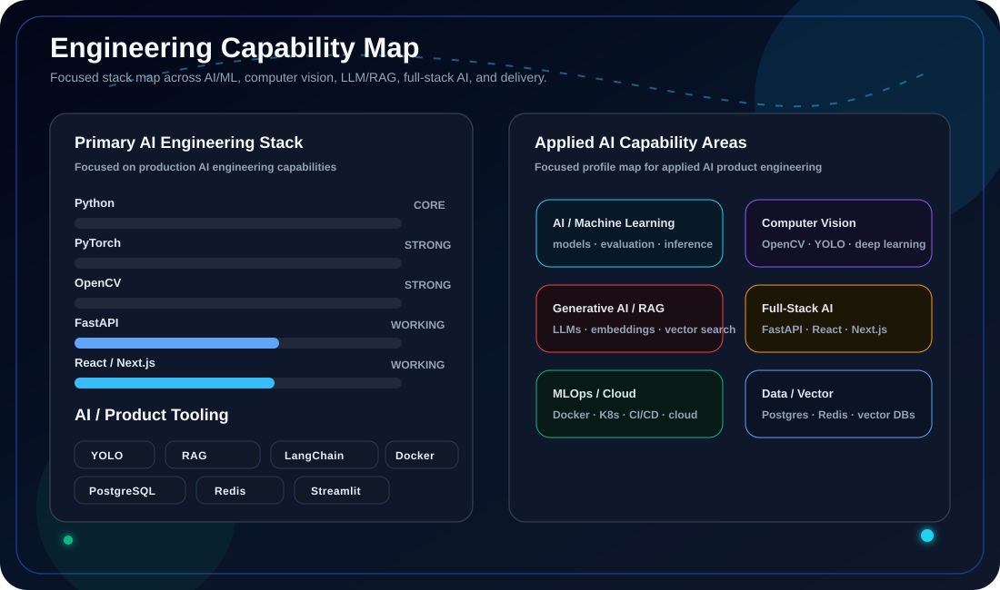
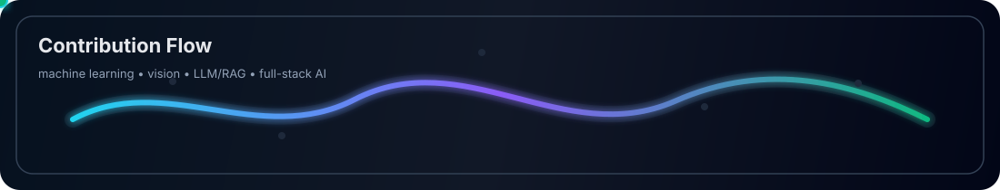
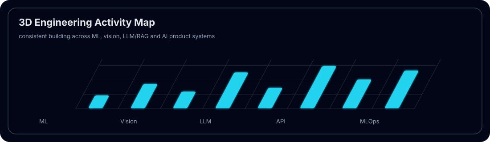

 

---

## ⚡ Positioning

> I build **production AI systems** across machine learning, computer vision, LLM/RAG applications, and full-stack AI products.

I focus on practical AI engineering: taking models and intelligent workflows from experimentation to reliable APIs, data pipelines, user-facing applications, and production deployment.

---

## 🧠 Engineering Identity

<table>
<tr>
<td width="50%">

### 🤖 AI / Machine Learning
- Applied machine learning and predictive modeling
- Anomaly detection with Isolation Forest and One-Class SVM
- Model training, evaluation, and optimization
- Feature engineering and data preprocessing
- Reinforcement and federated learning exposure
- ONNX-based edge ML inference

</td>
<td width="50%">

### 👁️ Computer Vision & Deep Learning
- PyTorch, TensorFlow, and OpenCV
- CNNs and deep learning workflows
- Image preprocessing and classification
- Object detection with YOLO
- Transfer learning and multimodal AI
- CLIP, SAM, OCR, and document intelligence

</td>
</tr>
<tr>
<td width="50%">

### 🧠 Generative AI / RAG
- LLM applications and prompt engineering
- RAG pipelines and semantic search
- LangChain and LlamaIndex
- Embeddings and vector databases
- OpenAI API and Hugging Face workflows
- LLM evaluation and model-quality feedback

</td>
<td width="50%">

### 🌐 Full-Stack AI Engineering
- Python / FastAPI AI backends
- React, Next.js, and Node.js interfaces
- REST APIs and real-time application integration
- PostgreSQL, Redis, MySQL, and MongoDB
- Streamlit-based AI interfaces
- Docker, cloud, CI/CD, and production deployment

</td>
</tr>
</table>

---

## 🧭 Experience Timeline

  

---

## 🛰️ System Map

  

---

## 🛠️ Tech Stack

### Core Languages

### AI / Machine Learning

### Computer Vision & Deep Learning

### Generative AI / Retrieval

### Full-Stack AI Engineering

### Data / Databases

### MLOps / Cloud / DevOps

---

## 🚀 Proof-of-Work Matrix

| Direction | Stack | Proof Signal |
|---|---|---|
| **AI / ML Engineering** | Python, Rust, PyTorch, TensorFlow, Scikit-learn, ONNX | Anomaly detection, predictive modeling, model evaluation and inference |
| **Computer Vision** | OpenCV, PyTorch, YOLO, CNNs | Image preprocessing, classification, object detection and multimodal workflows |
| **Generative AI / RAG** | LangChain, LlamaIndex, Hugging Face, embeddings, vector databases | LLM applications, RAG assistants, semantic retrieval and evaluation |
| **Full-Stack AI** | FastAPI, React, Next.js, Node.js, WebSockets, gRPC, PostgreSQL, Redis | AI APIs and user-facing intelligent applications delivered end to end |
| **MLOps / Deployment** | Docker, Kubernetes, CI/CD, AWS/GCP | Model deployment, monitoring, reproducible delivery and production operation |
| **AI Product Evaluation** | LLM testing, dataset review, model feedback | Structured evaluation across reasoning, safety, quality and reliability |

---

## 📊 Engineering Capability Map

  

---

## 🐍 Contribution Flow

  

---

## 🧊 Contribution Graph

  

---

## 🎯 Role Alignment

  

---

## 🤝 Connect

---

